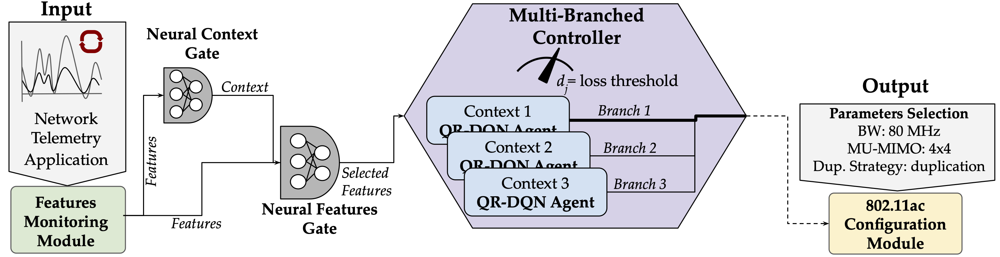

# SOAR: Semantic Multi-User MIMO Communications for Reliable Wireless Edge Computing 

Reliability (SOAR), a task-oriented multi-user MIMO framework for wireless edge computing executing vision tasks, e.g. object detection and image classification. SOAR pipeline uses distributional deep reinforcement learning (DDRL) agents with a multi-branched context-aware neural network.

This repository provides the full implementation and experimental setup to replicate the results presented in our paper:

The code includes:
- *DRL*: A Deep Reinforcement Learning (DRL) environment tailored for MU-MIMO task offloading
- *System Packages & Experiments*: Scripts to run and log experimental evaluations
- *Experiments*: Configurations and setup instructions to reproduce all figures and metrics from the paper
- *Test Corruption*: Computer vision task corruption test

<p align="center">

</p>

## Citation

If you find our work useful, please cite us:

> L.G. Contreras, S., Haque, F., Levorato, M., & Restuccia, F.  
> *SOAR: Semantic MU-MIMO Communications for Reliable Offloading of Computer Vision Tasks*.  
> IEEE International Conference on Distributed Computing in Smart Systems and the Internet of Things (DCOSS-IOT), IEEE, 2025. In press.

**Cite us:**

```bibtex
@inproceedings{contreras2025soar,
  author    = {L.G. Contreras, Sharon and Haque, Foysal and Levorato, Marco and Restuccia, Francesco},
  title     = {{SOAR: Semantic MU-MIMO Communications for Reliable Offloading of Computer Vision Tasks}},
  booktitle = {IEEE International Conference on Distributed Computing in Smart Systems and the Internet of Things (DCOSS-IOT)},
  year      = {2025},
  note      = {In press},
  publisher = {IEEE}
}


