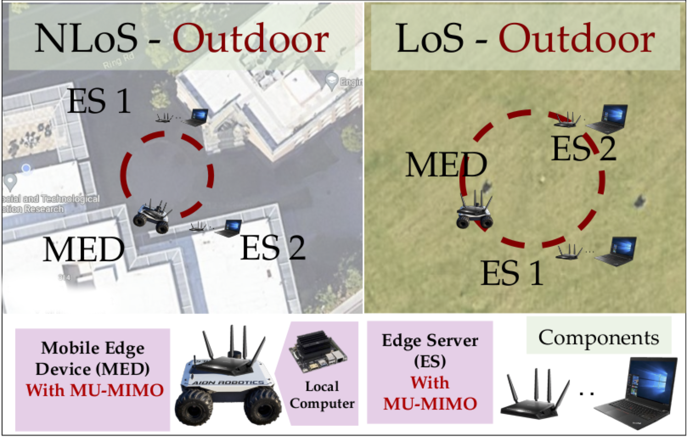

# SOAR: Semantic Multi-User MIMO Communications for Reliable Wireless Edge Computing 

This repository contains the core components, datasets, configurations, and scripts used for our research and experiments involving Deep Reinforcement Learning (DRL), MU-MIMO systems, and real-world dataset analysis.

---

## 📁 Folder Structure

### 🔍 `Corruption Test`
Scripts for evaluating model robustness under synthetic and real-world corruptions.

### 🤖 `DRL`
Training and evaluation code for deep reinforcement learning agents in wireless communication environments.

### 📊 `Dataset`
Preprocessed datasets used for training, validation, and corruption testing.

### 🧪 `Experiments`
Experiment configurations, logs, and result summaries.

### 🖼️ `Images`
Figures and diagrams used in reports or publications.

### 📶 `MU-MIMO Configuration`
Configuration files for MU-MIMO simulations and signal processing pipelines.

### 📦 `System Packages`
Scripts and files for setting up dependencies and system environment.

### 🛠️ `Utils`
General-purpose utilities for data handling, logging, and visualization.

---

## 📄 Related Publications

If you use this code or data in your research, please cite the following papers:

- **[Author Name], et al.**, *Context-Aware Offloading with DRL in MU-MIMO Systems*, in Proceedings of IEEE MILCOM, 2024.  
  `[BibTeX]`
  ```bibtex
  @inproceedings{your2024milcom,
    author    = {Sharon L. de Guevara and Marco Levorato},
    title     = {Context-Aware Offloading with DRL in MU-MIMO Systems},
    booktitle = {Proc. IEEE Military Communications Conference (MILCOM)},
    year      = {2024}
  }

<p align="center">

</p>

<p align="center">

</p>
