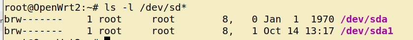

# MU-MIMO-Drone-Offloading

In this project, we investigate the various challenges of Data offloading from drone to the ground stations exploiting the downlink beamforming with multiple receive & sending antenna as well as streams. We intend to address the challenges with State-Of-The-Art Deep Learning techniques by defining the required offloading stratagies. 

For the  drone offloading task, we consider IEEE 802.11ac / 11 ax Multi User Multiple Input Multiple Output (MU-MIMO) system where Drones will be offloading various tasks like image detection, classification or segmentation to the  ground stations. Thus, the Drone is considered as the Access Point (AP) whereas the ground nodes are the Stations (STA) of the MU-MIMO system. 

We devide this whole system into several sections as follows: 

##### **1. Device Configurations**
##### **2. Installing Required Packages**
##### **3. Setup the MU-MIMO**
##### **4. Accessing and Configuring the Network Remotely**
##### **5. Data Offloading** 

## 1. Device Configurations 

For the flexibility of the different configurations of MU-MIMO we use Netgear Nighthawk R7800 router as both AP and STAs which supports IEEE 802.11ac. Our first step would be to flash the routers with OpenWrt which allows us to exploit tools like iw, ifconfig, hostapd etc. We will go with the TFTP flashing which is more easier and convenient than that of the other exixting flashing processes. Please find the openwrt-22.03.2 image (which we will flash) for the R7800 in Device_Configuration folder.

### Prerequisites for TFTP flashing

1. A TFTP client for our computer. In Ubuntu, install it with 
```
sudo apt install tftp 
```
2. Plug the ethernet cable to the computer and LAN port 4 of the router (actually any LAN port should be ok). Make the IP address of the connected ethernet port of the PC as following: <br />
*IP address: anything in 192.168.1.2 - 192.168.1.253 <br />
Subnet mask: 255.255.255.0  <br />
Default Gateway: 192.168.1.1 <br />*

### Flash with OpenWrt

1. Turn off the power, push and hold the reset button (in a hole on backside) with a pin
2. While still holding the reset button, turn on the power, and the power led starts flashing white (after it first flashes orange for a while)
3. Release the reset button after the power led flashes white (for at least 10 times), immediately execute the tftp command on your computer. 
```
tftp -i [router IP] put [firmware filename].[file format]
```
For our case, it would be: 
``` 
tftp -i 192.168.1.1 put openwrt-22.03.2_r7800-squashfs.img
```
<br/>

4. The power led will stop flashing if succeeded in transferring the image, and the router reboots rather quickly with the new firmware.

5. After it boots, it should have the default IP of OpenWrt which is "192.168.1.1". Try to ping "192.168.1.1" from the host PC. 

6. If the pinging works fine, go ahead with  ``` ssh root@192.168.1.1``` and we should be logged in as by default, no password is set.   


## 2. Installing Required Packages
For installing packages, we have two choices, (i) download the required packages in "ipk" format in host PC, scp the file to the R7800, and install with opkg. 

*As we can see from the image name that our OpenWrt vesion is 22.03.2, we should look for the ipk releases for the 22.03.2 version*

For our case, all the necessary packages can be found [here](https://archive.openwrt.org/releases/22.03.2/packages/arm_cortex-a15_neon-vfpv4/packages/)

2. All the necessary ipk files are also available in "Device_Configuration" folder. At first, download and scp the files to the router with 

```
scp xxx.ipk root@192.168.1.1:/tmp/
```
and install the package with 

```
opkg install  /tmp/xxx.ipk
```
##### Please install all the provided packages which would be necessary down the line.  

**(ii)Second** option would be to facilitate the R7800 with internet access and install with ``` opkg install xxx ```

For this, plug in the ethernet cable (with access to the global network) to the yellow port of the R7800 and try updating the packages with ``` opkg update``` (after ssh-ing to the R7800 itself). If that works fine, you are good to go. Install the packages with the following commmands: 

```
opkg install iperf3
```
```
opkg install kmod-usb-storage &&
opkg install kmod-usb-storage-uas &&
opkg install usbutils &&
opkg install block-mount &&
opkg install gdisk &&
opkg install e2fsprogs &&
opkg install kmod-fs-ext4
```
**However,** if the ethernet doesn't allow us the internet access (it might happen due to the router firewall policy or configuration), we can either change the router configuration from GUI or we can connect the router to a wifi. I would suggest to go with the phone's hotspot as you can setup one step authentication (unlike many university / organization network) to allow the R7800 easy access. 

I assume, your PC is still connected to the R7800 with an ethernet cable, thus access the GUI, by browsing ```192.168.1.1``` from a browser. login with username "admin" and keep the password field blank. Find the wireless tab in the luci (GUI) and scan for your hotspot. Now, you can install the required packages. 

Now, let's setup the MU-MIMO

## 3. Setup the MU-MIMO


For setting up a MU-MIMO system with IEEE802.11ac, at first we need to setup a network with proper configuration. For this, the required configuration files are provided in "MU-MIMO_Configuration" folder. 

### Configure IP and Connection

1. I assume that, you followed the earlier steps to setup the devices. In that case, all the routers should have the same LAN-IP: 192.168.1.1. I also assume you have at least total of 3 device to setup the multi-user network. I have four devices, so I will setup one of the device as AP and other as STAs. 
2. Now we connect each of the device one by one to our host machine with an ethernet cable as described earlier and change the LAN-IP of them except for one device, for which we will keep the LAN-IP as 192.168.1.1 and setup as the AP.   
3. To change the  LAN-IP of any device, at first ssh with the default OpenWrt IP: 192.168.1.1 with 
```
ssh root@192.168.1.1
```
then, lets change the default IP to 192.168.1.2 and we name it as STA1,
```
ifconfig br-lan 192.168.1.2
```
Your terminal should freeze and log you out of the GUI if you were logged in. Please give it some time,close the terminal and open a new one to log back in with new LAN-IP: 192.168.1.2. 

<br/>
4. Setup the other two devices with the following configuration:

*<br/>STA2: 192.168.1.3 <br/>
STA3: 192.168.1.4 <br/>*

**<br/> However, in no way it is mandatory to have the exact same IP as mentioned above, I have only done so to maintain a certain pattern to make me remmber easily.**
<br/>
<br/>
6. Now, connect all the devices with ethernet cable as shown in the figure and connect one of the routers with your host machine. In this way, you should have the access to all the connected device. Try to reach each of the device by pinging with their LAN-IP. If that works, you are good to go to the next steps. If that doesn't work, please check your connection and IP of the ethernet port of your host machine which can be anything in the same subnet, for example: 192.168.1.100.  

### Setup AP and STAs

**Setup AP:** To set up the AP, we scp the "MU-MIMO_Configuration/AP" directory to the target device:

On the host machine:
```
scp -r AP root@192.168.1.1:/root/
```

On R7800, run : ``` Run_AP_C_1_N_1.sh ``` or ``` Run_AP_C_2_N_2.sh ``` or ``` Run_AP_C_3_N_3.sh ``` depending on the configuration that you want to do. They are respectively for 1-antenna-1-stream, 2-antenna-2-stream, 3-antenna-3-stream.

Now you should be able to see, a network name **test5G** when you scan for available wifi network on any device. 

**Setup STAs:** Now, let's set up STAs.

On the host machine: 

```
scp -r STAs root@192.168.1.x:/root/                 here, x=2/3/4
```
Next, connect the STA to the created WLAN: **test5G.** Please be in the STAs directory of the R7800 at first by ssh-ing and then ``` cd /root/STAs```

Then, 

```
wpa_supplicant -B -i#interface -Dnl80211 -c wpa_supplicant.conf
```
In our case the interface is wlan0, 

```
wpa_supplicant -B -iwlan0 -Dnl80211 -c wpa_supplicant.conf
```
It will only work if you have "systemd-networkd" daemon enabled which is in there in OpenWrt by default. However, other OS like Ubuntu 20.04 might not have "systemd-networkd" enabled or installed by default as it manages the network with "NetworkManager service". In those cases, you can connect your device with GUI or *nmcli* tool. 

This can be generalized to any device/ OS and the Network Interface Card (NIC) which allows you to change the number of antennas and spatial streams. We have tested NGW8265, AX200 and AX2100. (We will keep updating the list).

Now, run ```./start_client_N_1_C_1.sh``` or ```start_client_N_1_C_1.sh``` or ```start_client_N_1_C_1.sh``` respectively for 1-antenna-1-stream, 2-antenna-2-stream and 3-antenna-3-stream respectively. 

**NOW**
It's time for trying out the MU-MIMO system that we have setup. SSH to the *AP* with ``` ssh root@192.168.1.1 ```.
```
The scripts that we executed earlier, set up the WLAN ip of the AP as 192.168.10.1 and STA1, STA2 and STA3 as 192.168.10.2, 192.168.10.3 and 192.168.10.4 respectively.
```
Thus, from AP try pinging the other STAs over the air with WLAN IPs with ``` ping 192.168.10.x```. It should work. For somereasons, if it does not restart the routers and repeat "Setup AP and STAs."

Start *iperf3* server in all the STAs with executing ```iperf3 -s``` in the STAs.
From the AP, start transmitting the iperf3 packets to each of the STAs with multiple streams with 
```
iperf3 -c 192.168.10.x -u -b 10G -t 300 -P 30
```
here 192.168.10.x is the STA IP. For three different STAs, start the *iperf* client like above command in three different terminal window of AP. 

### ******************************Remmember to select the the WLAN IP*****************************


### Let's See if they Beamform !! 

1. The host machine should have the NIC which can sniff in the monitor mode. We have tested *NGW8265* and *AX200*.
2. Install airmon-ng tool with 
```
sudo apt-get install -y aircrack-ng
```
3. For sniffing install Wireshark with
```
sudo apt install wireshark
```
4. Now go into the monitor mode with 
```
sudo airmon-ng start wlp6s0

```
where wlp6s0 is your wireless interface which youy can check with *ifconfig*

5. Now select the right channel and bandwith before start the sniffing, 
```
sudo iw dev wlp6s0mon set channel 157 80MHz
```
I am sniffing in channel 157 with 80MHz bandwidth as my target network is operating in the same channel and bandwidth. 

6. Start the Wireshark with ```sudo wireshark```. and start the capture from the capture tab. From capture tab go to options and select wlp6smon (in your case the interface most likely has a different name) and also check the monitor option.
7. Now as you are sniffing in the same channel as your network, you shoud be able to find the NDP and beamforming feedback by searching the keywords "NDP" and "feedback" (select regular expression in the search type).
8. If you are getting some packets with NDP and Feedback, you are surely beamforming. if not, try with lower number of antenna and spatial stream of the STAs and taking the STAs further away from each other. My suggestion is to start with 2 STAs each with 1 antenna and 1 spatial stream. whereas the AP must haave atleast 2 antennas and 2 spatial stream and keep the devices 5-10 meter away from each other.  


## 4. Accessing and Configuring the Network Remotely

Now, in case of Drone Offloading, the AP will on top of the Drone and the STAs will be at the ground primarily. However, in this case, we can not have the wires access to each of the devices (AP and STAs) as the AP will be on the fly and the STAs will be scattered in an open field or Drone testbed.

To address this, we create a separate wireless network with jetson nanos and connect them with the devices (AP and STAs) with ethernet. In that way, being in the second wireless network, the host machine ssh to the jetson and then from inside the jetson, ssh to the devices (AP and STAs) to change the configutration on the fly. It it mentionable that, the AP of the second wireless network can be at the center of the drone testbed giving us the omnidirectional coverage. 

For this we equiped the jetson with NICs (AX200) and antennas. and connect them as shown in the figure: 


     
     
## 5. Data Offloading

For data offloading from drone to the ground STA, we need to equip the devices -the routers (both AO and STAs) with external storage. Otherwise the memmory overflow in the NVRAM might cause the crashing the OS or at least the configs. 

Thus we plug in external storage to the R7800 which fortunately support the external USB storages. 

Let's format the external drives in ext4 format before plugging them in. Once plugges in, please check if the OS can find the USB: 

```
ls -l /dev/sd*
```
You should see something like this: 



Let's create the file system: 
```
mkfs.ext4 /dev/sda1
```
Now, generate the config entry for the fstab file
```
block detect | uci import fstab
```
It's better to enable the auto-mount: 
```
uci set fstab.@mount[-1].enabled='1' 
uci commit fstab
```

Now reboot the system, you should be able to find the external drive in ```/mnt/sdX``` directory. 

