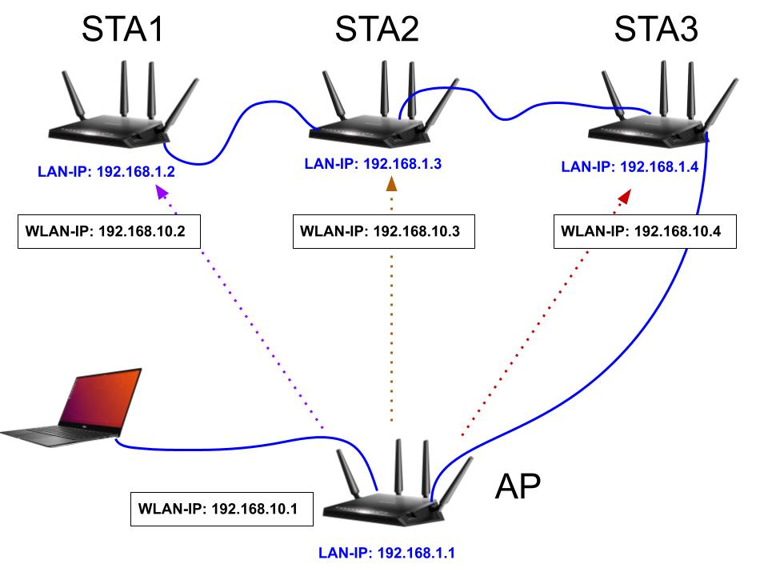

# MU-MIMO-Drone-Offloading

In this project, we investigate the various challenges of Data offloading from drone to the ground stations exploiting the downlink beamforming with multiple receive & sending antenna as well as streams. We intend to address the challenges with State-Of-The-Art Deep Learning techniques by defining the required offloading stratagies. 

For the  drone offloading task, we consider IEEE 802.11ac / 11 ax Multi User Multiple Input Multiple Output (MU-MIMO) system where Drones will be offloading various tasks like image detection, classification or segmentation to the  ground stations. Thus, the Drone is considered as the Access Point (AP) whereas the ground nodes are the Stations (STA) of the MU-MIMO system. 

We devide this whole system into several sections as follows: 

##### **1. Device Configurations**
##### **2. Installing Required Packages**
##### **3. Setup the MU-MIMO**
##### **4. Accessing and Configuring the Network Remotely**
##### **5. Data Offloading** 

## 1. Device Configurations 

For the flexibility of the different configurations of MU-MIMO we use Netgear Nighthawk R7800 router as both AP and STAs which supports IEEE 802.11ac. Our first step would be to flash the routers with OpenWrt which allows us to exploit tools like iw, ifconfig, hostapd etc. We will go with the TFTP flashing which is more easier and convenient than that of the other exixting flashing processes. Please find the openwrt-22.03.2 image (which we will flash) for the R7800 in Device_Configuration folder.

### Prerequisites for TFTP flashing

1. A TFTP client for our computer. In Ubuntu, install it with 
```
sudo apt install tftp 
```
2. Plug the ethernet cable to the computer and LAN port 4 of the router (actually any LAN port should be ok). Make the IP address of the connected ethernet port of the PC as following: <br />
*IP address: anything in 192.168.1.2 - 192.168.1.253 <br />
Subnet mask: 255.255.255.0  <br />
Default Gateway: 192.168.1.1 <br />*

### Flash with OpenWrt

1. Turn off the power, push and hold the reset button (in a hole on backside) with a pin
2. While still holding the reset button, turn on the power, and the power led starts flashing white (after it first flashes orange for a while)
3. Release the reset button after the power led flashes white (for at least 10 times), immediately execute the tftp command on your computer. 
```
tftp -i [router IP] put [firmware filename].[file format]
```
For our case, it would be: 
``` 
tftp -i 192.168.1.1 put openwrt-22.03.2_r7800-squashfs.img
```
4. The power led will stop flashing if succeeded in transferring the image, and the router reboots rather quickly with the new firmware.
5. After it boots, it should have the default IP of OpenWrt which is "192.168.1.1". Try to ping "192.168.1.1" from the host PC. 
6. If the pinging works fine, go ahead with  ``` ssh root@192.168.1.1``` and we should be logged in as by default, no password is set.   


## 2. Installing Required Packages
For installing packages, we have two choices, (i) download the required packages in "ipk" format in host PC, scp the file to the R7800, and install with opkg. \newline
*As we can see from the image name that our OpenWrt vesion is 22.03.2, we should look for the ipk releases for the 22.03.2 version*

For our case, all the necessary packages can be found [here](https://archive.openwrt.org/releases/22.03.2/packages/arm_cortex-a15_neon-vfpv4/packages/)

2. All the necessary ipk files are also available in "Device_Configuration" folder. At first, download and scp the files to the router with 

```
scp xxx.ipk root@192.168.1.1:/tmp/
```
and install the package with 

```
opkg install  /tmp/xxx.ipk
```
##### Please install all the provided packages which would be necessary down the line.  

**(ii)Second** option would be to facilitate the R7800 with internet access and install with ``` opkg install xxx ```

For this, plug in the ethernet cable (with access to the global network) to the yellow port of the R7800 and try updating the OS with ``` opkg update``` (after ssh-ing to the R7800 itself). If that works fine, you are good to go. Install the packages with the following commmands: 

```
opkg install iperf3
```
```
opkg install kmod-usb-storage &&
opkg install kmod-usb-storage-uas &&
opkg install usbutils &&
opkg install block-mount &&
opkg install gdisk &&
opkg install e2fsprogs &&
opkg install kmod-fs-ext4
```
**However,** if the ethernet doesn't allow us the internet access (it might happen due to the router firewall policy or configuration), we can either change the router configuration from GUI or we can connect the router to a wifi. I would suggest to go with the phone's hotspot as you can setup one step authentication (unlike many university / organization network) to allow the R7800 easy access. 

I assume, your PC is still connected to the R7800 with an ethernet cable, thus access the GUI, by browsing ```192.168.1.1``` from a browser. login with username "admin" and keep the password field blank. Find the wireless tab in the luci (GUI) and scan for your hotspot. Now, you can install the required packages. 

Now, let's setup the MU-MIMO

## 3. Setup the MU-MIMO



For setting up a MU-MIMO system with IEEE802.11ac, at first we need to setup a network with proper configuration. For this, the required configuration files are provided in "MU-MIMO_Configuration" folder. 

### Configure IP and Connection

1. I assume that, you followed the earlier steps to setup the devices. In that case, all the routers should have the same LAN-IP: 192.168.1.1. I also assume you have at least total of 3 device to setup the multi-user network. I have four devices, so I will setup one of the device as AP and other as STAs. 
2. Now we connect each of the device one by one to our host machine with an ethernet cable as described earlier and change the LAN-IP of them except for one device, for which we will keep the LAN-IP as 192.168.1.1 and setup as the AP.   
3. To change the  LAN-IP of any device, at first ssh with the default OpenWrt IP: 192.168.1.1 with 
```
ssh root@192.168.1.1
```
then, lets change the default IP to 192.168.1.2 and we name it as STA1,
```
ifconfig br-lan 192.168.1.2
```
Your terminal should freeze and log you out of the GUI if you were logged in. Please give it some time,close the terminal and open a new one to log back in with new LAN-IP: 192.168.1.2.
5. Setup the other two devices with the following configuration: <br/>
*
STA2: 192.168.1.3 <br/>
STA3: 192.168.1.4 <br/>
*
<br/>
<br/>
**However, in no way it is mandatory to have the exact same IP as mentioned above, I have only done so to maintain a certain pattern to make me remmber easily.**
<br/>
<br/>
6. Now, connect all the devices with ethernet cable as shown in the figure and connect one of the routers with your host machine. In this way, you should have the access to all the connected device. Try to reach each of the device by pinging with their LAN-IP. If that works, you are good to go to the next steps. If that doesn't work, please check your connection and IP of the ethernet port of your host machine which can be anything in the same subnet, for example: 192.168.1.100.  
